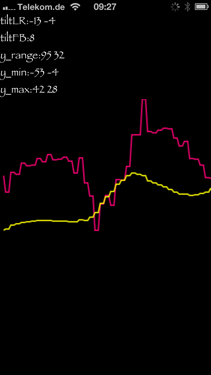

motiontracker
=============

_html5 DeviceMotionEvent playground5_

you only need
[assets/js/motiontracker.js](https://github.com/spearwolf/motiontracker/blob/master/assets/js/motiontracker.js)
if you want to use the library for your own satisfaction.

to build the html example project you need [Hammer For Mac][http://hammerformac.com/].

have fun!
wolfger@spearwolf.de

